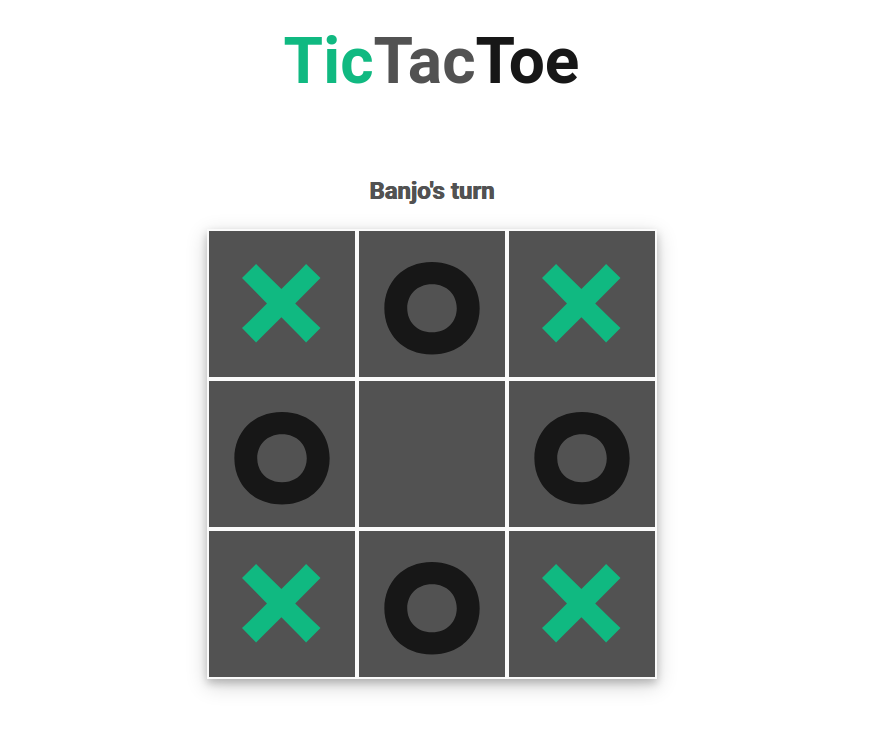

# tic-tac-toe

A tic-tac-toe game. Built with the module design pattern using HTML, CSS & JS.

[Demo here](https://casssb.github.io/tic-tac-toe/)

## Thoughts
Using factory functions and IIFE modules actually felt pretty comfortable. I can see why keeping as many variables off the global namespace as possible makes logical sense when working with larger codebase's.

## Possible Improvements
* I've been reading through a few articles on using the minimax algorithm and may setup an AI bot. Setting up an easy version of the bot should also be pretty straightforward using Math.random.
* As always I’m not happy with the UI design and may come back and add a little more flair to the form.

## Credits
* icons taken from [Material Design](https://materialdesignicons.com/)
* project idea from [The Odin Project](https://www.theodinproject.com/lessons/node-path-javascript-tic-tac-toe)
